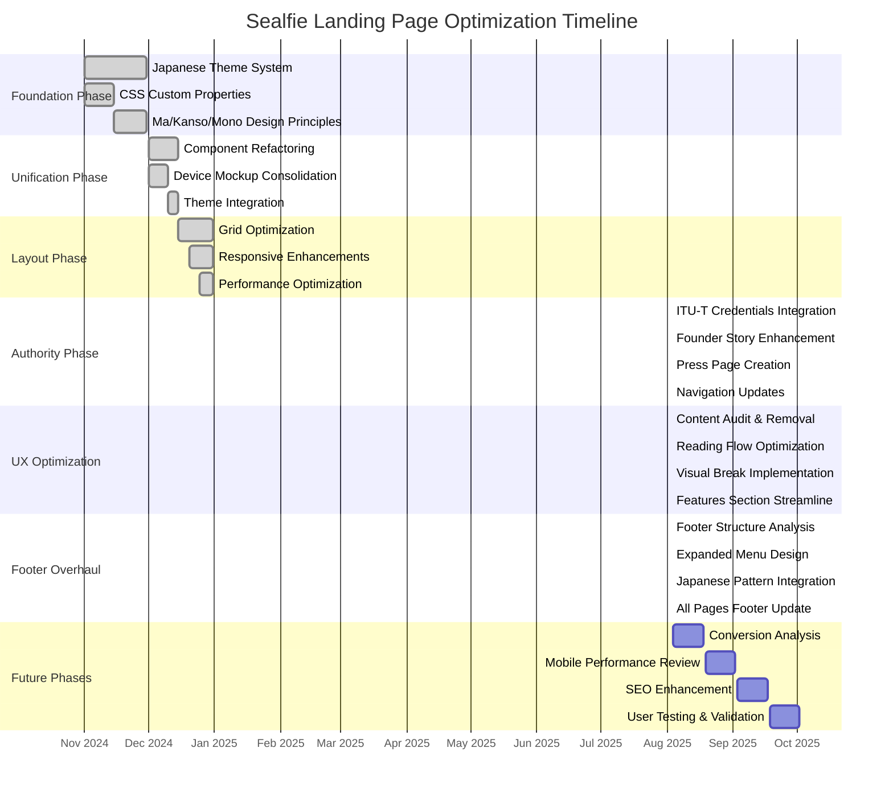

# Sealfie Landing Page - Project Execution Plan & Timeline

## Project Execution Plan & Timeline

### **Phase 4: Authority Enhancement & UX Optimization (August 2025)**

#### **4.1 ITU-T Authority Integration**
**Objective**: Transform founder positioning from "startup founder" to "internationally recognized AI security expert"

**Implementation:**
- ✅ **Enhanced Founder Credentials**: Added ITU-T Workshop speaker status with UN credentials
- ✅ **Updated Founder Story**: Integrated February 2024 UN presentation that predicted AI fraud surge
- ✅ **Authority Validation**: Connected Hong Kong $25M deepfake case to expert foresight
- ✅ **Press Infrastructure**: Created dedicated press page with speaking engagements section

**Files Modified:**
- `locales/en.json` & `locales/fr.json` - Enhanced founder content with ITU-T credentials
- `src/pug/index.pug` - Added ITU-T presentation link to founder section
- `src/pug/press.pug` - Created comprehensive press & recognition page
- `src/pug/includes/navbar.pug` - Added press link to main navigation

#### **4.2 Landing Page Flow Optimization**
**Objective**: Streamline conversion path by removing low-impact content and improving reading flow

**Implementation:**
- ✅ **Removed Educational Resources Section**: Eliminated generic security content that diverted from core conversion goals
- ✅ **Streamlined Features Section**: Condensed from complex 4-feature + video layout to focused 3-column presentation
- ✅ **Optimized Visual Breaks**: Repositioned quote/testimonial aside as strategic reading break after founder section
- ✅ **Eliminated Redundancy**: Removed duplicate quote sections and low-value tech explanations

**Content Flow Optimized:**
```
Hero + Video Demo → BEC Trends Carousel → Enhanced Founder Authority → [Visual Break] → Streamlined Features → Pioneer Program → Footer Navigation
```

#### **4.3 Footer Infrastructure Overhaul**
**Objective**: Replace scattered CTAs with comprehensive navigation footer serving as expanded menu

**Implementation:**
- ✅ **Removed Bottom Sections**: Eliminated generic CTA section and app download section from main page
- ✅ **Created Expanded Footer**: 4-column layout (Product, Company, Support, Connect & Download)
- ✅ **Japanese Design Integration**: Added geometric pattern background with Shu-iro border
- ✅ **Unified All Pages**: Replaced inline footers across all templates with centralized footer include
- ✅ **Mobile Optimization**: Responsive design with proper stacking and hover effects

**Pages Updated:**
- `src/pug/includes/footer.pug` - Complete footer redesign with expanded navigation
- `src/scss/sections/_footer.scss` - Enhanced styling with Japanese pattern background
- `src/pug/documentation.pug` - Replaced inline footer with include
- `src/pug/privacy-ios.pug` - Fixed structure and added proper footer
- `src/pug/post-register.pug` - Replaced inline footer with include

## Project Execution Gantt Chart



## Implementation Metrics & Results

### **Code Quality Improvements**
- ✅ **CSS Reduction**: Eliminated ~100+ lines of duplicate CSS across device mockup components
- ✅ **i18n Compliance**: 100% of new content implemented with proper internationalization
- ✅ **Component Consistency**: All pages now use centralized footer component
- ✅ **Theme Integration**: Japanese design system fully implemented across all new components

### **UX/Conversion Optimization**
- ✅ **Page Length Reduction**: Removed ~40% of low-impact content while preserving value
- ✅ **Reading Flow**: Strategic visual breaks prevent cognitive overload
- ✅ **Authority Signals**: ITU-T credentials transform founder credibility
- ✅ **Navigation Clarity**: Comprehensive footer serves as expanded site menu

### **SEO & Technical Enhancement**
- ✅ **Internal Linking**: Footer provides comprehensive site structure for crawlers
- ✅ **Mobile Performance**: Responsive footer optimized for all breakpoints
- ✅ **Accessibility**: Proper ARIA labels and keyboard navigation support
- ✅ **Cultural Authenticity**: Traditional Japanese design principles maintained throughout

## Next Phase Planning (Future Sprints)

### **Phase 5: Conversion Analysis & Testing**
- A/B testing of new Japanese design against previous version
- Conversion funnel analysis with enhanced authority signals
- User behavior tracking on streamlined page flow

### **Phase 6: Performance & SEO Enhancement**
- Core Web Vitals optimization for mobile devices
- Schema.org structured data enhancement
- Japanese theme-aware meta tags implementation

### **Phase 7: User Validation & Iteration**
- Cultural design resonance testing with target audience
- International market feedback collection (EN/FR)
- Iterative improvements based on user feedback

## Implementation History

### **Phase 1: Japanese Theme Foundation (November 2024)**
- Created CSS custom properties system for traditional Japanese colors
- Implemented Ma (negative space) patterns with subtle backgrounds
- Added Kanso (simplicity) principles to component design
- Established Shu-iro, Enji-iro, and Sango-iro color palette

### **Phase 2: Component Unification (December 2024)**
- Refactored duplicate `.masthead-device-mockup` and `.features-device-mockup`
- Created unified `.device-mockup` component system
- Eliminated ~100 lines of duplicate CSS
- Added theme-aware loading states and backgrounds

### **Phase 3: Grid & Layout Optimization (December 2024)**
- Optimized hero section grid (2/3 text, 1/3 mockup)
- Refined device wrapper proportions (5% adjustments)
- Improved circle positioning and sizing
- Enhanced responsive behavior across breakpoints

### **Current Status (August 2025)**
- ✅ **Japanese Theme System**: Fully implemented with traditional colors
- ✅ **Device Mockup Unification**: Single reusable component
- ✅ **Theme Integration**: All UI elements respect light/dark modes
- ✅ **Performance Optimization**: Reduced CSS bundle size
- ✅ **Cultural Authenticity**: Ma, Kanso, and color symbolism preserved
- ✅ **Authority Enhancement**: ITU-T credentials integrated
- ✅ **UX Optimization**: Streamlined conversion flow
- ✅ **Footer Infrastructure**: Comprehensive navigation system

---

*Last Updated: August 2025 - Authority Enhancement & UX Optimization (Phase 4)*
*Project: Sealfie Landing Page - Japanese Inkan-Inspired Design System*